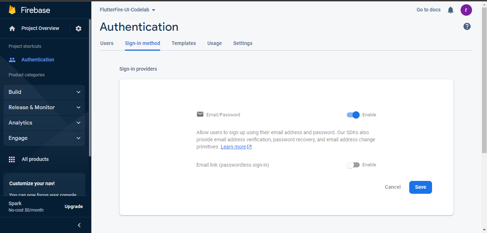
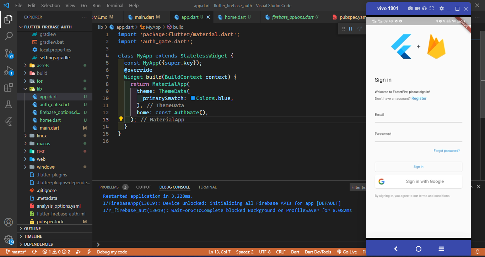
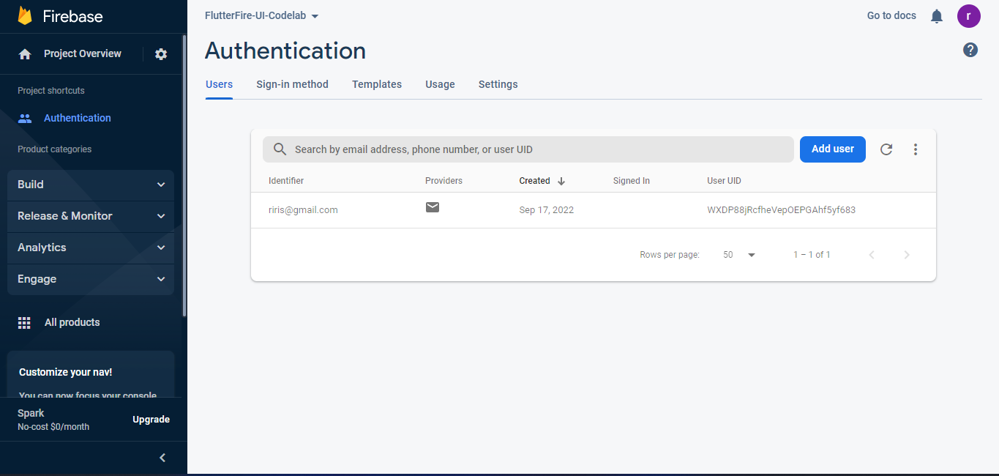
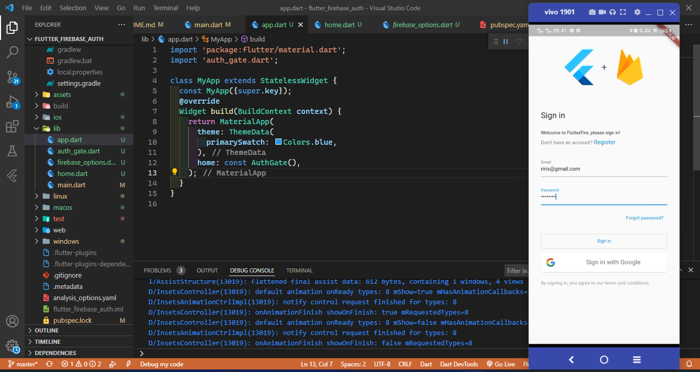
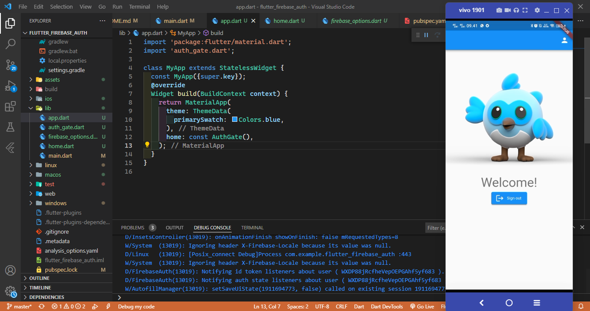

# flutter_firebase_auth

A new Flutter project.

### Buat dan siapkan proyek Firebase
Di Firebase console, klik Tambahkan Proyek (atau Buat proyek ), dan masukkan nama untuk proyek Firebase Anda (misalnya, " FlutterFire-UI-Codelab ").



### Mendapatkan kode sampel
Kloning repositori GitHub 
```
git clone https://github.com/flutter/codelabs.git 
```
### Instal FlutterFire CLI
```
dart pub global activate flutterfire_cli
```

### Tambahkan proyek Firebase Anda ke aplikasi Flutter Anda
Setelah selesai, lihat aplikasi Flutter di editor teks Anda. FlutterFire CLI telah membuat file baru bernama firebase_options.dart
```
flutterfire configure
```

### Tambahkan paket Firebase ke aplikasi Flutter

```
flutter pub add firebase_core
flutter pub add firebase_auth
flutter pub add flutterfire_ui
```

### Tampilan Layar masuk 




### Layar Profil
